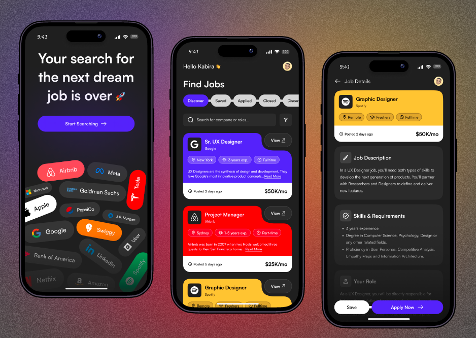

# Job board

## Project Overview
This is a job board project that displays a number of jobs available from number of sources around the web in one place making it possible for the user to get access to them and even apply for them if see fit for the job. It has job descriptions so that the user can clearly see all requirements.

## Tech Stack 
For this project I used HTML for markup and Tailwind CSS for the styling of the whole application where it is visually clear and responsive all devices.

## Screenshots
